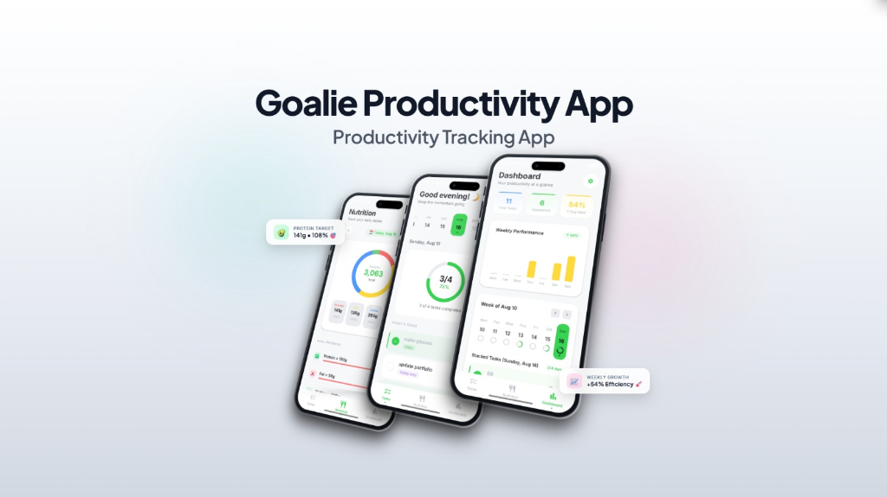

# ⚡ Goalie — Daily Productivity & Nutrition Tracking App

<p align="center">
  
</p>

<p align="center">
  <a href="#-tech-stack"></a>
  <a href="#-tech-stack"></a>
  <a href="#-tech-stack"></a>
  <a href="#-tech-stack"></a>
  <a href="#-presentation-cover-deck"></a>
</p>

<p align="center">
  <b>Goalie</b> is a native, modern, offline-first Android productivity and health companion. Built entirely with <b>Kotlin</b> and <b>Jetpack Compose</b>, Goalie harmoniously bridges daily task momentum, macro-nutrient intake targets, and weekly performance analytics in a fast, fluid, and delightful UI.
</p>

---

## 🌟 Key Features

### 1. 📅 Daily Tasks & Momentum (`TasksScreen`)
- **Daily Progress Ring**: Instant circular completion gauge with completed task ratio (e.g. `3/4 • 75%`).
- **Interactive Calendar Ribbon**: Horizontally scrollable 7-day strip with real-time day status indicators.
- **Dynamic Task Management**: Add, complete, and delete tasks with smooth animations, strikethrough transitions, and priority tagging (Daily, Today Only, etc.).
- **Smart Notifications**: Scheduled daily reminders and momentum checks via Android `AlarmManager` and `NotificationHelper`.

### 2. 🥗 Macro-Nutrient & Calorie Tracker (`NutritionScreen`)
- **Multi-Segment Calorie Ring (`CalorieRingChart`)**: Visual breakdown of daily calorie budget (`kcal`) segmented by macronutrients.
- **Macro Target Cards**: Real-time tracking and percentage calculations for **Protein**, **Fat**, **Carbs**, and **Sugar**.
- **Goal Progress Bars**: Color-coded progress indicators with dynamic threshold warnings (e.g., `Protein > 130g`, `Fat < 59g`).
- **Quick Logging**: Floating action button modal to log meals, snacks, and nutrition metrics on the go.

### 3. 📊 Productivity & Consistency Dashboard (`DashboardScreen`)
- **High-Level KPI Summary**: Instant cards displaying **Total Tasks**, **Completed Tasks**, and **7-Day Consistency Rate (%)**.
- **Weekly Performance Bar Chart (`WeeklyChart`)**: Day-by-day bar chart showing momentum peaks throughout the week.
- **30-Day Contribution Heatmap Grid (`HeatmapGrid`)**: GitHub-style activity grid where cell color intensity dynamically scales with daily completion rates (Level 0 through Level 4 Emerald).
- **Stacked Tasks Timeline**: Grouped historical task breakdown by date with quick inspection.

### 4. 🎨 Interactive Web Presentation Cover (`cover/`)
- High-fidelity **3D iPhone presentation mockup** showcase designed in HTML/CSS/JS.
- **Customizable**: Live editable titles, theme switcher (Studio, Dark Pro, Emerald, Mesh), layout modes (3D Fan, Spread, Flat, Isometric), and draggable/rotatable badges.
- **1-Click Export**: High-resolution 2x Retina PNG export and clipboard copy ready for Dribbble, Behance, and pitch decks.

---

## 🛠️ Tech Stack & Architecture

| Layer | Technology | Purpose |
| :--- | :--- | :--- |
| **Language** | **Kotlin 2.1.0** | Modern, type-safe, expressive Android development |
| **UI Toolkit** | **Jetpack Compose (v2024.12)** | Declarative UI framework with fluid animations |
| **Design System** | **Material 3 (Material You)** | Adaptive themes, soft typography, dynamic color tokens |
| **Architecture** | **MVVM + Clean Architecture** | Unidirectional Data Flow (UDF), ViewModel & StateFlow |
| **Database** | **Room 2.6.1 + SQLite** | Offline-first, fast local storage for tasks & nutrition data |
| **Concurrency** | **Kotlin Coroutines & Flow** | Asynchronous non-blocking database queries & state streams |
| **Navigation** | **Compose Navigation 2.8.5** | Single-Activity bottom navigation with smooth transitions |
| **Reminders** | **AlarmManager + BroadcastReceiver**| Persistent daily notifications & reboot scheduling |
| **Build System** | **Gradle 8.11.1** | Modern version catalogs (`libs.versions.toml`) |

---

## 📂 Project Directory Structure

```
Goalie/
├── docs/
│   ├── cover.png                        # Presentation showcase cover image
│   └── ui_redesign.md                   # UI/UX design specifications
├── cover/
│   ├── index.html                       # 3D interactive web presentation cover
│   ├── assets.js                        # Offline Base64 asset bundle
│   └── assets/                          # Raw screen mockups & references
├── mockup/
│   └── index.html                       # Interactive UI prototype
└── app/
    ├── build.gradle.kts
    └── src/main/
        ├── AndroidManifest.xml
        └── java/com/tasktracker/daily/
            ├── MainActivity.kt          # Host Activity for Compose UI
            ├── DailyTrackerApp.kt       # Application class & Room DB singleton
            ├── data/                    # Room DB Entities, DAOs & Backup
            │   ├── AppDatabase.kt
            │   ├── Task.kt
            │   ├── TaskDao.kt
            │   ├── Nutrition.kt
            │   ├── NutritionDao.kt
            │   └── BackupManager.kt
            ├── viewmodel/               # MVVM ViewModels
            │   ├── TaskViewModel.kt
            │   └── NutritionViewModel.kt
            ├── notifications/           # Reminders & Alarm Scheduling
            │   ├── NotificationHelper.kt
            │   ├── NotificationScheduler.kt
            │   ├── NotificationReceiver.kt
            │   └── BootReceiver.kt
            └── ui/
                ├── theme/               # Color palette, Type & Theme system
                ├── components/          # Reusable Compose Widgets
                │   ├── CalorieRingChart.kt
                │   ├── CircularProgressRing.kt
                │   ├── HeatmapGrid.kt
                │   ├── WeeklyChart.kt
                │   ├── WeeklyTaskCalendar.kt
                │   ├── TaskItem.kt
                │   └── AddTaskDialog.kt
                ├── screens/             # Main Destination Screens
                │   ├── SplashScreen.kt
                │   ├── TasksScreen.kt
                │   ├── NutritionScreen.kt
                │   └── DashboardScreen.kt
                └── navigation/
                    └── AppNavigation.kt # Bottom Navigation & NavHost
```

---

## 🚀 Getting Started

### Prerequisites
- **Android Studio Ladybug (2024.2+)** or newer
- **JDK 17** or **JDK 21**
- Android SDK **API 26+** (Android 8.0 Oreo minimum, Target API 35)

### Running on Android Device / Emulator
1. Clone or open the repository in **Android Studio**:
   ```bash
   git clone https://github.com/Azukakomai/Goalie.git
   ```
2. Let Gradle sync dependencies.
3. Select your target device or Android Virtual Device (AVD).
4. Click **Run (`Shift + F10`)**.

### Launching the Interactive Web Cover
To preview or export custom presentation shots of the app:
```powershell
start cover\index.html
```
*Or open `cover/index.html` directly in any web browser.*

---

## 📄 License
This project is open-source and available under the [MIT License](LICENSE).
