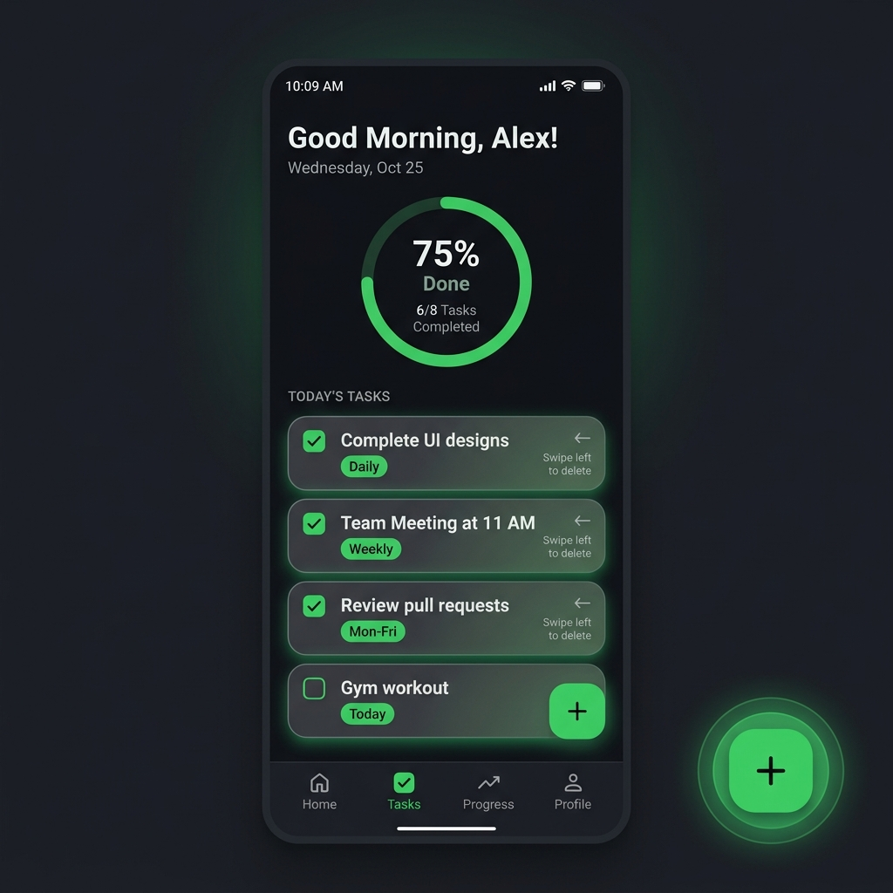
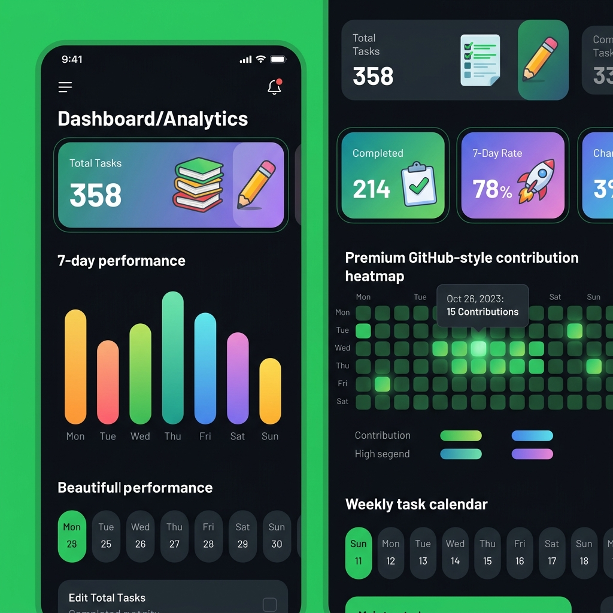
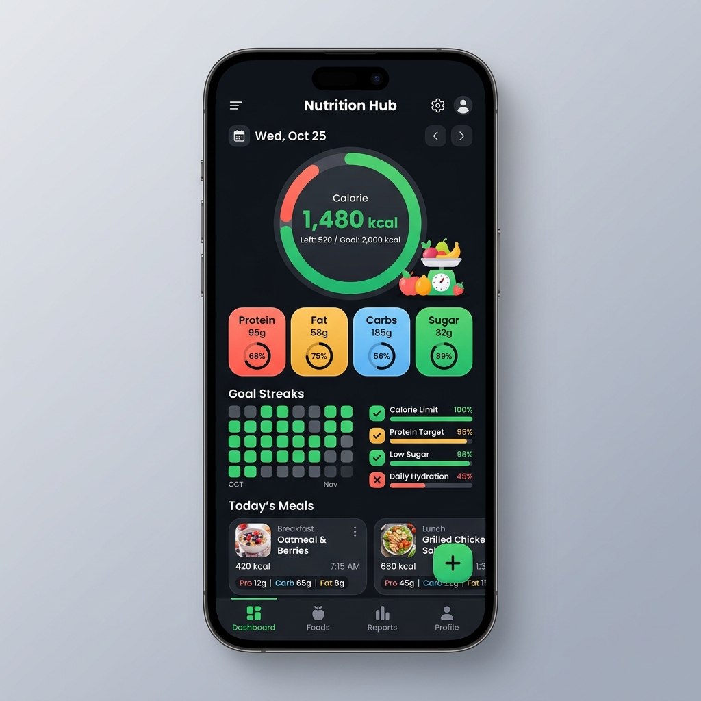

# 🎨 Goalie — UI Redesign Specification

> **Direction:** Keep the GitHub-emerald dark theme identity. Modernize with bold, playful Duolingo-inspired elements — generous rounding, vibrant accents, richer data visualization, and micro-animations.

---

## Visual Mockups

### Tasks Screen


### Dashboard Screen


### Nutrition Screen


---

## 1. Design Principles

| Principle | Current | Redesign |
|---|---|---|
| **Corner Radius** | 12–16dp cards | **20–24dp** generous rounding everywhere |
| **Depth** | Flat cards with 1dp outline borders | **Subtle elevation shadows** + border; selected states get a faint green glow |
| **Color** | Mono-emerald accent on neutral dark | Keep emerald primary, but **add secondary accent gradients** on key surfaces |
| **Typography** | System default (Roboto) | **Inter** or **Outfit** font family imported via downloadable fonts |
| **Motion** | Minimal (`animateColorAsState`) | **Spring-based animations**, shared element transitions, animated number counters |
| **Density** | Tight spacing | **More breathing room** — 20dp section gaps, 24dp horizontal padding |

---

## 2. Theme Changes

### 2.1 Color Palette Additions

Keep existing colors. Add these new tokens:

| Token | Dark Value | Light Value | Purpose |
|---|---|---|---|
| `GradientStart` | `#1A39D353` (emerald @ 10%) | `#1A39D353` | Gradient overlays on hero cards |
| `GradientEnd` | `#0039D353` (emerald @ 0%) | `#0039D353` | Gradient fade-out |
| `GlowGreen` | `#3339D353` (emerald @ 20%) | `#2639D353` | Glow/shadow around selected items |
| `AccentCoral` | `#FF6B6B` | `#FF6B6B` | Protein, destructive actions |
| `AccentAmber` | `#FFD93D` | `#FFD93D` | Fat macro |
| `AccentSky` | `#4D96FF` | `#4D96FF` | Carbs macro |
| `AccentMint` | `#6BCB77` | `#6BCB77` | Sugar macro |
| `CardElevated` | `#1C2128` | `#FFFFFF` | Elevated card surface (slightly lighter than `DarkSurface`) |

### 2.2 Typography

Switch from `FontFamily.Default` to **Inter** (via Google Fonts downloadable fonts API or bundled `.ttf`).

```
headlineLarge:  Inter, Bold, 28sp, lineHeight 36sp
headlineMedium: Inter, Bold, 24sp, lineHeight 32sp  (existing)
titleLarge:     Inter, SemiBold, 20sp                (existing)
titleMedium:    Inter, Medium, 16sp                  (existing)
bodyLarge:      Inter, Regular, 16sp                  (existing)
bodyMedium:     Inter, Regular, 14sp                  (existing)
labelSmall:     Inter, Medium, 11sp                   (existing)
labelLarge:     Inter, SemiBold, 13sp                 (NEW — for section labels)
```

### 2.3 Shape System

Introduce a consistent shape scale:

| Name | Radius | Usage |
|---|---|---|
| `ShapeSmall` | 8dp | Chips, badges, inline tags |
| `ShapeMedium` | 16dp | Buttons, text fields |
| `ShapeLarge` | 20dp | Cards, dialogs |
| `ShapeXL` | 28dp | Bottom sheet, FAB |
| `ShapePill` | 50% | Avatar, circular indicators |

---

## 3. Bottom Navigation Bar

### Current
Standard Material 3 `NavigationBar` with flat icons, no personality.

### Redesign

| Aspect | Change |
|---|---|
| **Shape** | Add a top `RoundedCornerShape(topStart = 24.dp, topEnd = 24.dp)` clip on the nav bar container |
| **Indicator** | Replace the default pill indicator with a **floating pill** that slides between items with spring animation |
| **Selected Icon** | Scale up to **1.15x** with a bounce spring on selection |
| **Elevation** | Add `8.dp` `tonalElevation` for depth |
| **Labels** | Bold `labelSmall` for selected, regular for unselected |
| **Haptics** | Light haptic tick on tab switch |

---

## 4. Tasks Screen — Redesign

### 4.1 Header Section

**Current:** "Daily Tasks" title + date subtitle + seed button.

**Redesign:**
- Replace with a **greeting-based header**: "Good evening, keep going! 🔥" with the date below
- Add a **streak counter** badge (e.g., "🔥 5 day streak") if consecutive completion data is available
- Move the seed button into the Settings dialog (not a daily workflow action)

### 4.2 Progress Card → Circular Progress Ring

**Current:** Linear progress bar in a flat card.

**Redesign:**
- Replace `LinearProgressIndicator` with a **circular arc / ring** using `Canvas` + `drawArc`
- Ring dimensions: **120dp diameter**, **12dp stroke width**
- Track color: `surfaceVariant`; progress arc color: **emerald gradient** (`#26A641` → `#39D353`)
- Center of ring displays: **"3/5"** (completed/total) in `headlineLarge` bold
- Below the ring: **"60% Complete"** in `bodyMedium`
- Animate the arc with `animateFloatAsState` (spring damping 0.7)
- The entire progress section should be a **hero card** with a subtle gradient background overlay (`GradientStart` → transparent)

### 4.3 Task Items

**Current:** Card with checkbox, title, recurrence badge, edit/delete icons.

**Redesign:**

| Aspect | Change |
|---|---|
| **Card shape** | `RoundedCornerShape(20.dp)` (up from 12dp) |
| **Checkbox** | Replace Material `Checkbox` with a **custom animated circle checkbox**: unchecked = outlined circle with emerald border; checked = filled circle with ✓ icon + scale-up bounce animation |
| **Completed state** | Card background shifts to `primary.copy(alpha = 0.06f)` with a subtle left-border accent (3dp emerald bar) instead of just opacity reduction |
| **Swipe actions** | Add `SwipeToDismiss` (Material 3): swipe-left reveals red delete background; swipe-right reveals green "complete" background. Remove the always-visible delete/edit icon buttons |
| **Long-press** | Long-press opens an **edit bottom sheet** instead of inline edit icon |
| **Recurrence badges** | More rounded (`ShapeSmall`), add a faint colored background (`primary.copy(alpha = 0.1f)`) |
| **Entry animation** | Use `AnimatedVisibility` with `fadeIn + slideInVertically` when tasks are first loaded or added |

### 4.4 Empty State

**Current:** Plain text "No tasks for today yet!"

**Redesign:**
- Center-aligned illustration (an icon composition or simple vector graphic — e.g., a target/bullseye with sparkles)
- Title: **"All clear for today!"** in `titleLarge`
- Subtitle: **"Tap + to set your first goal"** in `bodyMedium`, muted color
- The FAB should have a **pulsing glow animation** when the list is empty to draw attention

### 4.5 Floating Action Button

**Current:** Standard emerald FAB with `+` icon, `RoundedCornerShape(16.dp)`.

**Redesign:**
- Shape: `RoundedCornerShape(20.dp)` or `CircleShape`
- Add a **subtle pulsing glow** (animated shadow radius cycling 0dp → 12dp → 0dp, emerald color) when there are 0 tasks
- On press: add a satisfying **scale-down spring** (`0.9f` → `1f`)
- Consider adding a **speed-dial** expansion: long-press expands to show "Add Task" + "Quick Routine" (future feature)

---

## 5. Dashboard Screen — Redesign

### 5.1 Stat Cards (Top Row)

**Current:** 3 small flat cards with number + label.

**Redesign:**
- Each stat card gets a **gradient background** tint:
  - Total Tasks → subtle blue-to-transparent gradient
  - Completed → subtle emerald-to-transparent gradient
  - 7-Day Rate → subtle amber-to-transparent gradient
- Number displayed in `headlineMedium`, bold, with an **animated counting effect** (rolls from 0 to final value on appear)
- Add a small illustrative **icon** in the top-right corner of each card (e.g., Checklist icon, Trophy icon, Trend icon) with `0.15f` alpha, `48dp` size — decorative background element
- Card shape: `RoundedCornerShape(20.dp)`, elevation `2.dp`

### 5.2 Weekly Performance Chart (Bar Chart)

**Current:** Horizontal bars per day inside a card. Functional but basic.

**Redesign:**
- Switch to **vertical bars** in a proper chart layout
- Each bar has a **rounded top** (`RoundedCornerShape(topStart = 6.dp, topEnd = 6.dp)`)
- Bar fill: **gradient from emerald-dark at bottom to emerald-bright at top**
- Background grid: faint horizontal dashed lines at 25%, 50%, 75%, 100%
- Day labels below bars (Mon, Tue, etc.)
- **Tap interaction**: tapping a bar shows a small tooltip popup above it with "Mon: 3/4 (75%)"
- Bars animate in with staggered `animateFloatAsState` (each bar delayed 50ms after the previous)
- Card header: "Weekly Performance" with a small trend arrow (↑/↓) showing improvement over last week

### 5.3 Weekly Task Calendar

**Current:** 7-day strip with rounded pill selectors. Good UX, needs visual polish.

**Redesign:**
- Day cells get a **taller, more spacious feel** (increase vertical padding to `14.dp`)
- Selected day: filled emerald with a **bouncy scale animation** on selection
- Today indicator: a small **dot below the day number** (even when not selected)
- Task completion dots: replace single dot with a **mini progress ring** (tiny 18dp ring showing completion %) inside each day cell
- Navigation arrows: add a smooth **slide transition** when changing weeks (week content slides left/right)

### 5.4 Contribution Heatmap (90-Day Grid)

**Current:** Basic grid of colored squares with numbers. Functional but flat.

**Redesign:**

| Aspect | Change |
|---|---|
| **Cell shape** | `RoundedCornerShape(8.dp)` (up from 6dp) — more rounded, pillowy squares |
| **Glow effect** | Level 3–4 cells get a faint `GlowGreen` shadow/blur effect to make them visually "pop" |
| **Selection** | Selected cell gets a **pulsing border animation** (not just a thicker static border) |
| **Tooltip** | On tap, show a **floating tooltip card** above the cell (not just the bottom banner) with date, stats, and a tiny bar chart |
| **Month labels** | Add **month labels** on the left side of the grid (Jan, Feb, Mar…) to improve scanability |
| **Legend** | Make the legend more visual — gradient bar from Level 0 → Level 4 color instead of discrete squares |
| **Animation** | On first load, cells **animate in** with a wave/cascade effect (staggered fade-in from top-left to bottom-right) |

---

## 6. Nutrition Screen — Redesign

### 6.1 Daily Intake Summary → Calorie Ring

**Current:** Big kcal number + 4 macro pills in a flat card.

**Redesign:**
- **Donut/Ring chart** (Canvas `drawArc`) taking center stage, `160dp` diameter
- The ring is segmented by macro contribution (protein arc in coral, fat arc in amber, carbs arc in blue, sugar arc in green), all drawn sequentially around the ring
- Center of ring: **total kcal** in `headlineLarge` bold + "kcal" label
- Below the ring: 4 macro pills in a row (keep existing `MacroPill` design but upgrade):
  - Each pill gets a **small circular progress indicator** (thin ring) showing % of daily goal met
  - Slightly larger (`12dp` vertical padding)
  - The value text animates with a counting effect

### 6.2 Date Navigator

**Current:** Card with chevron arrows, centered date text.

**Redesign:**
- Make it feel like a **horizontal date scroller/ticker** instead of a static card
- Left/right chevrons trigger a **slide animation** on the date text
- "Today" state gets a highlighted pill background with emerald accent
- Add subtle swipe gesture support (swipe left/right on the navigator area to change days)

### 6.3 Nutrition Heatmap

**Current:** Same grid style as the Dashboard heatmap.

**Redesign:**
- Apply the same improvements as Dashboard heatmap (glow, tooltip, month labels, cascade animation)
- Cells display **kcal** inside and use a **multi-color scale** based on goal accomplishment instead of just green:
  - 0 goals met: Level 0 (dark)
  - Some goals met: warm orange tones
  - All goals met: bright emerald

### 6.4 Goal Condition Badges

**Current:** Rows with check/X circle + goal text + current value.

**Redesign:**
- Add a **slim progress bar** under each badge showing how close the current value is to the target (e.g., if goal is "Protein ≥ 130g" and current is 95g, show a 73% filled bar)
- Met goals get a **celebration micro-animation** (brief confetti burst or shimmer) on first achievement
- Badge cards: `RoundedCornerShape(16.dp)`, slightly taller with `14dp` vertical padding

### 6.5 Meal Cards

**Current:** Flat card with meal name, macro row, edit/delete icons.

**Redesign:**
- Add a **colored left-border accent** (3dp bar) — color based on the meal's highest macro (e.g., high protein meal → coral border)
- Macro values displayed as **tiny colored chips/tags** in a flow row below the meal name
- Swipe-to-delete instead of always-visible delete icon
- Tap to expand: show full macro breakdown in an animated expand/collapse

---

## 7. Dialogs — Redesign

### 7.1 Add/Edit Task Dialog

**Current:** Standard `AlertDialog` with text field, recurrence chips, date chips.

**Redesign:**
- Convert to a **Bottom Sheet** (`ModalBottomSheet`) instead of `AlertDialog` for a more modern, mobile-native feel
- Bottom sheet has a drag handle at top
- Text field: increase height, add a subtle inner shadow effect
- Recurrence chips: use **SegmentedButton** style (connected pills) instead of separated boxes
- Date chips: add small **calendar icon** inside each chip
- Confirm button: full-width at bottom, `RoundedCornerShape(16.dp)`, with a gradient background

### 7.2 Settings Dialog

**Current:** `AlertDialog` with sections for notifications, import/export, reset.

**Redesign:**
- Convert to a **full Bottom Sheet** or even a **dedicated Settings screen** (navigate via the nav graph)
- Group settings into clear sections with `SectionHeader` composables
- Each setting row: icon + title + subtitle + control (switch/button) — more spacious layout
- Notification time picker: show an inline Material 3 `TimePicker` instead of the legacy `TimePickerDialog`
- Add app version info at the bottom

### 7.3 Add/Edit Meal & Goal Dialogs

- Same bottom-sheet treatment as the task dialog
- Macro input fields: arrange in a **2×2 grid** instead of a vertical stack for compactness
- Use colored labels matching the macro accent colors (protein field label in coral, etc.)

---

## 8. Splash Screen

**Current:** Static lime-green background with white logo icon, 1s delay.

**Redesign:**
- Background: use the app's dark theme `DarkBackground` color instead of the jarring lime-green
- Logo: **animate in** with a `scale (0.5 → 1.0)` + `fadeIn` spring animation
- Below logo: app name "Goalie" in `headlineLarge`, emerald color, fade in 200ms after logo
- Optional: a subtle **gradient pulse** radiating from the logo center
- Transition to main screen: **shared element transition** (logo morphs into the nav bar icon) if on Android 14+, otherwise simple fade

---

## 9. Micro-Animations & Motion System

| Animation | Where | Spec |
|---|---|---|
| **Counting numbers** | Stat cards, calorie total, macro values | `AnimatedContent` with `slideInVertically` + `fadeIn`, or custom `animateIntAsState` rolling from 0 to value |
| **Spring checkbox** | Task completion | Custom scale spring: `dampingRatio = 0.5f`, `stiffness = 300f` |
| **Staggered list items** | Task list, meal list, heatmap cells | Each item delayed by `index * 50ms`, `slideInVertically(initialOffset = 30dp) + fadeIn` |
| **Tab switch** | Bottom nav | Crossfade with `200ms` duration + icon scale bounce |
| **FAB press** | All FABs | `scale(0.9f)` on press, spring back to `1f` on release |
| **Card hover/press** | All cards | `scale(0.98f)` on press, subtle shadow increase |
| **Progress ring** | Tasks progress, calorie ring | `animateFloatAsState` with spring |
| **Swipe dismiss** | Task items, meal items | Material `SwipeToDismiss` with background color reveal |

---

## 10. Accessibility & Polish

- All interactive elements: **minimum 48dp touch target**
- All icons: proper `contentDescription` strings
- Color contrast: verify all text meets **WCAG AA** (4.5:1 ratio) on dark backgrounds
- Support dynamic font scaling (use `sp` for all text sizes, which is already done)
- Ripple effects: ensure all clickable surfaces have Material ripple
- Edge-to-edge: implement proper `WindowInsets` handling for system bars

---

## 11. File Impact Summary

| File | Change Type | Scope |
|---|---|---|
| `ui/theme/Color.kt` | MODIFY | Add new gradient, glow, and accent color tokens |
| `ui/theme/Theme.kt` | MODIFY | Add new colors to schemes, add `GoalieShapes` object |
| `ui/theme/Type.kt` | MODIFY | Switch to Inter font family, add `labelLarge` |
| `ui/navigation/AppNavigation.kt` | MODIFY | Rounded top nav bar, animated indicator, icon scale |
| `ui/screens/TasksScreen.kt` | MODIFY | Circular progress ring, greeting header, empty state |
| `ui/components/TaskItem.kt` | MODIFY | Custom checkbox, swipe gestures, increased rounding |
| `ui/components/AddTaskDialog.kt` | MODIFY | Convert to BottomSheet, segmented recurrence control |
| `ui/screens/DashboardScreen.kt` | MODIFY | Gradient stat cards, animated counters |
| `ui/components/WeeklyChart.kt` | **MAJOR REWRITE** | Vertical bars with gradients, tooltips, staggered animation |
| `ui/components/HeatmapGrid.kt` | MODIFY | Glow effects, tooltips, month labels, cascade animation |
| `ui/components/WeeklyTaskCalendar.kt` | MODIFY | Mini progress rings, slide transitions, spacious cells |
| `ui/screens/NutritionScreen.kt` | **MAJOR REWRITE** | Calorie ring chart, progress bars on goals, swipe meals |
| `ui/components/SettingsDialog.kt` | MODIFY | Bottom sheet conversion, inline time picker |
| `ui/screens/SplashScreen.kt` | MODIFY | Dark background, animated logo entry |
| `ui/components/AnimationUtils.kt` | **NEW** | Shared animation specs (springs, stagger helpers) |
| `ui/components/CircularProgressRing.kt` | **NEW** | Reusable Canvas-based circular progress composable |
| `ui/components/CalorieRingChart.kt` | **NEW** | Multi-segment donut chart for nutrition macros |
| `ui/components/SwipeableTaskItem.kt` | **NEW** | Wrapper with `SwipeToDismiss` for task/meal items |

---

## 12. Implementation Priority

> Recommended order to implement changes, from highest visual impact to lowest:

1. **Theme foundations** — Colors, typography (Inter font), shape tokens
2. **Circular progress ring** — High visibility on Tasks screen hero
3. **Task items** — Custom checkbox, swipe, increased rounding
4. **Bottom nav bar** — Rounded top, animated indicator
5. **Dashboard stat cards** — Gradients, animated counters
6. **Weekly chart** — Vertical bars rewrite
7. **Heatmap** — Glow, cascade animation, tooltips
8. **Nutrition calorie ring** — Multi-segment donut
9. **Dialog → Bottom sheet** conversions
10. **Splash screen** — Quick polish
11. **Micro-animations** — Staggered lists, springs, press states
